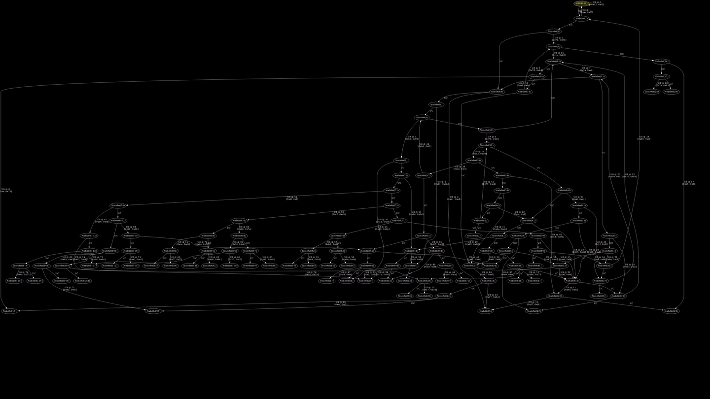

# Summary

This is a environment for measuring and observing the behaviors of fuzzers from
inside the fuzzer itself.

This allows for comparing fuzzers without having to worry about them having
different definitions of performance and coverage.

# Visualizations

This tool provides real-time visualizations of coverage as it happens, so you
can not only see what was hit, but what is being hit frequently!

It's important to note, while this tool currently mainly does visualizations,
we'll likely start working on analyizing results statistically rather than
eyeballing images!

# Usage

To use this, simply run `cargo run` in `prog_gen` to create a random program.
This random program expects a filename as the argument once compiled which is
then used as the fuzz input for the randomly generated program.

This program then reports status via shared memory to a file which can be
observed and monitored in a web browser by using `coverage_server`. Run `cargo
run` in coverage server and it will monitor the shared memory for changes on an
interval, and when new changes are observed the information will be pushed over
a websocket to a website which will visualize the coverage in realtime via
graphviz SVG.

## TL;DR

Run `cargo run` in `prog_gen` to generate a random program.

Run `cargo run` in `coverage_server` to monitor coverage events.

Run `python3 -m http.server` in `coverage_server` to host the coverage viewer
website, and navigate to the locally hosted website.

